# Applied Deep Learning Resources
A collection of research articles, blog posts, slides and code snippets about deep learning in applied settings. Including trained models and simple methods that can be used out of the box. Mainly focusing on Convolutional Neural Networks (CNN) but Recurrent Neural Networks (RNN), deep Q-Networks (DQN) and other interesting architectures will also be listed.

# CNN

Latest overview of the CNNs can be found from the paper *"Deep learning for visual understanding: A review"* [[link](http://www.sciencedirect.com/science/article/pii/S0925231215017634), [PDF](articles/Deep learning for visual understanding A review.pdf)]

Another decent overview in Nature by LeCun, Bengio and Hinton: *"Deep learning"* [[link](http://www.nature.com/nature/journal/v521/n7553/full/nature14539.html), [PDF](https://www.docdroid.net/11p1b/hinton.pdf.html)]

## ImageNet
[ImageNet](http://www.image-net.org/) is the most important image classification and localization competition. Other data sets with results can be found from here: *"Discover the current state of the art in objects classification."* [[link](http://rodrigob.github.io/are_we_there_yet/build/classification_datasets_results.html)].

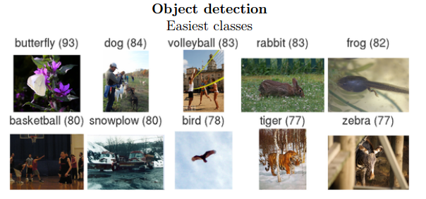

Prediction error of the ImageNet competition has been decreasing rapidly over the last 5 years:
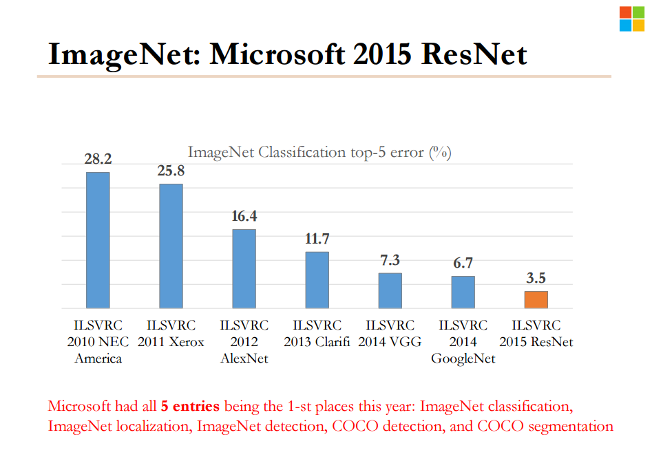

## Main network architectures on ImageNet

### AlexNet

Original paper: *"ImageNet Classification with Deep Convolutional Neural Networks"* [[PDF](http://www.cs.toronto.edu/~fritz/absps/imagenet.pdf)]

Properties: 8 weight layers (5 convolutional and 2 fully connected), 60 million parameters, Rectified Linear Units (ReLUs),  Local Response Normalization, Dropout

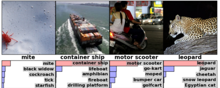

### VGG

Original paper: *"Very Deep Convolutional Networks for Large-Scale Image Recognition"* [[arxiv](http://arxiv.org/abs/1409.1556)]

Properties: 19 weight layers, 144m parameters, 3x3 convolution filters, L2 regularised, Dropout, No Local Response Normalization

### GoogLeNet

Original paper: *"Going deeper with convolutions"* [[arxiv](http://arxiv.org/abs/1409.4842)]

Lates upgrade to the model achieves even better scores with models and import to Torch: *"Rethinking the Inception Architecture for Computer Vision"* [[arxiv](http://arxiv.org/abs/1512.00567)], *"Torch port of Inception V3"* [[github](https://github.com/Moodstocks/inception-v3.torch)]

Properties: 22 layers, 7m parameters, Inception modules, 1x1 conv layers, ReLUs, Dropout, Mid-level outputs

Inception modules:

### ResNet

Original paper: *"Deep Residual Learning for Image Recognition"* [[arxiv](http://arxiv.org/abs/1512.03385)]

Very nice slides: *"Deep Residual Learning"* [[PDF](http://research.microsoft.com/en-us/um/people/kahe/ilsvrc15/ilsvrc2015_deep_residual_learning_kaiminghe.pdf)]

Properties: 152 layers, ReLUs, Batch Normalization (See *"Batch Normalization: Accelerating Deep Network Training by Reducing Internal Covariate Shift"* [[arxiv](http://arxiv.org/abs/1502.03167)]), less hacks (no dropout), more stable (different number of layers work as well) and lower complexity than VGG.

Main building block of the network:

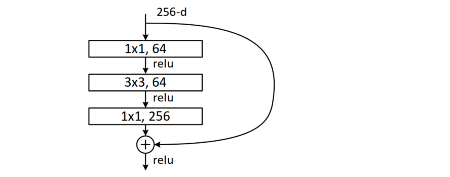

Features are also very good and transferable with (faster) R-CNNs (see below):

### Other architectures

* Deep Learning for 3D shapes: *"3D ShapeNets: A Deep Representation for Volumetric Shapes"* [[PDF](http://people.csail.mit.edu/khosla/papers/cvpr2015_wu.pdf)]

* Code and a model for faces: *"Free and open source face recognition with deep neural networks."* [[github](https://github.com/cmusatyalab/openface)]

* Fast neural networks which can perform arbitrary filters for images: *"Deep Edge-Aware Filters"* [[PDF](http://jmlr.org/proceedings/papers/v37/xub15.pdf)]

* Lot's of different models in Caffe's *"Model Zoo"* [[github](https://github.com/BVLC/caffe/wiki/Model-Zoo)]

## Feature learning and object detection

* *"CNN Features off-the-shelf: an Astounding Baseline for Recognition"* [[arxiv](http://arxiv.org/abs/1403.6382)]

* First paper about R-CNN: *"Rich feature hierarchies for accurate object detection and semantic segmentation"* [[PDF](http://www.cs.berkeley.edu/~rbg/papers/r-cnn-cvpr.pdf), [slides](https://courses.cs.washington.edu/courses/cse590v/14au/cse590v_wk1_rcnn.pdf)]

* *"Faster R-CNN: Towards Real-Time Object Detection with Region Proposal Networks"* [[arxiv](http://arxiv.org/abs/1506.01497), [github](https://github.com/ShaoqingRen/faster_rcnn), [Slides](http://research.microsoft.com/en-us/um/people/kahe/iccv15tutorial/iccv2015_tutorial_convolutional_feature_maps_kaiminghe.pdf)]

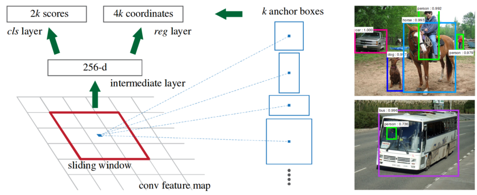

* *"An Empirical Evaluation of Deep Learning on Highway Driving"* [[arxiv](http://arxiv.org/abs/1504.01716)]

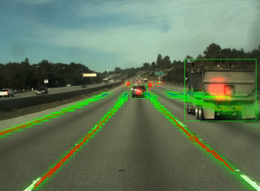

* *"Object Detectors Emerge in Deep Scene CNNs"* [[arxiv](http://arxiv.org/abs/1412.6856)]

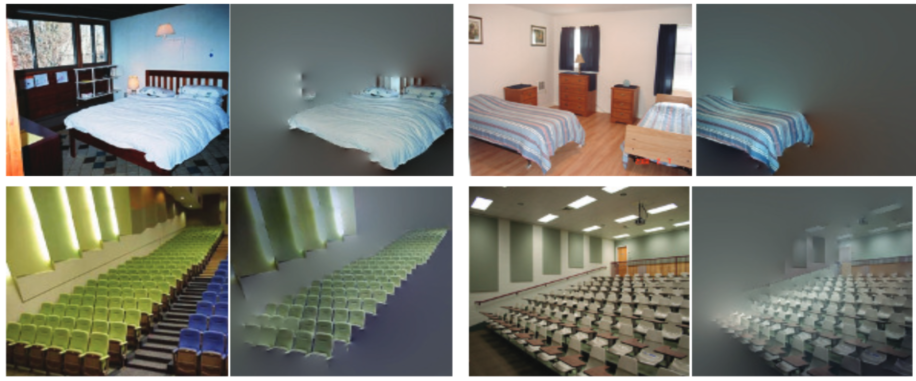

* Faster and better features: *"Efficient Deep Feature Learning and Extraction via StochasticNets"* [[arxiv](http://arxiv.org/pdf/1512.03844.pdf)]

## Other

* Code and models for automatic captions of images: *"Deep Visual-Semantic Alignments for Generating Image Descriptions"* [[web poster](http://cs.stanford.edu/people/karpathy/deepimagesent/), [PDF](http://cs.stanford.edu/people/karpathy/cvpr2015.pdf), [github](https://github.com/karpathy/neuraltalk2)]

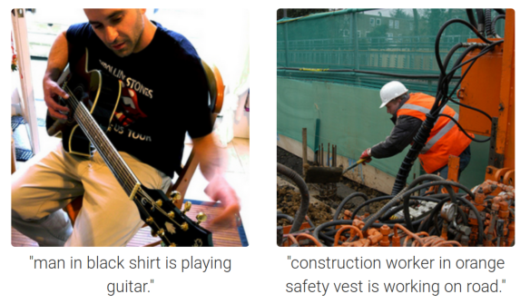

* Google Deep Dream or neural networks on LSD: *"Inceptionism: Going Deeper into Neural Networks"* [[link](http://googleresearch.blogspot.ch/2015/06/inceptionism-going-deeper-into-neural.html), [deepdreamer.io/](http://deepdreamer.io/)]

Deep dreaming from noise:

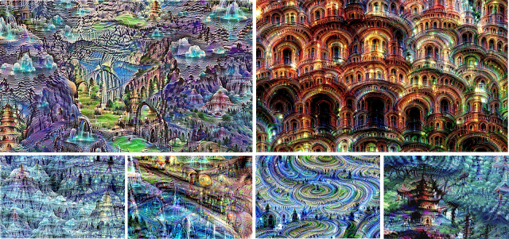

* Code and models for mixing arbitrary content and art style: *"A Neural Algorithm of Artistic Style"* [[arxiv](http://arxiv.org/abs/1508.06576), [deepart.io](http://deepart.io/), [a blog post](http://mlg.eng.cam.ac.uk/lloyd/blog-2015-09-01-neural-art.html), [github.com/jcjohnson/neural-style](https://github.com/jcjohnson/neural-style)]

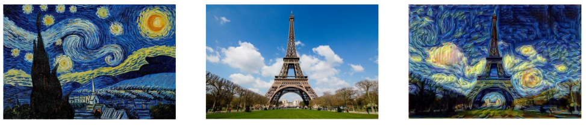

* *"Automatic Colorization"* and it includes a pre-trained model [[Link](http://tinyclouds.org/colorize/)]

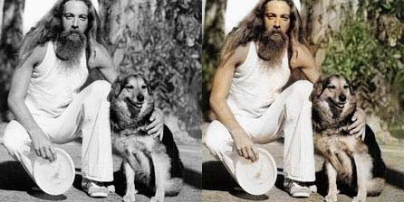

* *"Learning visual similarity for product design with convolutional neural networks"* [[PDF](http://www.cs.cornell.edu/~kb/publications/SIG15ProductNet.pdf)]

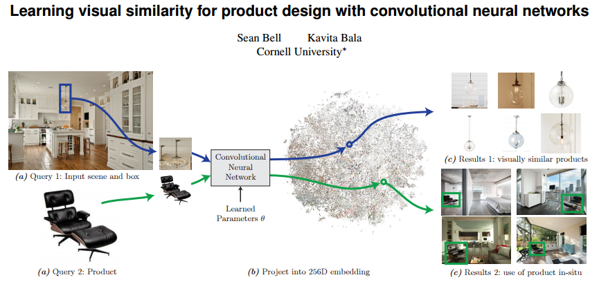

* Using images and image descriptions to improve search results: *"Images Don’t Lie: Transferring Deep Visual Semantic Features to Large-Scale Multimodal Learning to Rank"* [[arxiv](http://arxiv.org/abs/1511.06746)]

* *"How Google Translate squeezes deep learning onto a phone"* [[post](http://googleresearch.blogspot.co.uk/2015/07/how-google-translate-squeezes-deep.html)]

* *"What a Deep Neural Network thinks about your #selfie"* [[blog](http://karpathy.github.io/2015/10/25/selfie/)]

Top selfies according to the ConvNet:

* *"Recommending music on Spotify with deep learning"* [[github](http://benanne.github.io/2014/08/05/spotify-cnns.html)]

* *"DeepStereo: Learning to Predict New Views from the World's Imagery"* [[arxiv](http://arxiv.org/abs/1506.06825)]

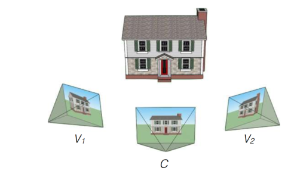

* Classifying street signs: *"The power of Spatial Transformer Networks"* [[blog](http://torch.ch/blog/2015/09/07/spatial_transformers.html)] with *"Spatial Transformer Networks"* [[arxiv](http://arxiv.org/abs/1506.02025)]

* *"Pedestrian Detection with RCNN"* [[PDF](http://cs229.stanford.edu/proj2015/172_report.pdf)]

# DQN

* Original paper: *"Playing Atari with Deep Reinforcement Learning"* [[arxiv](http://arxiv.org/abs/1312.5602)]

* My popular science article about DQN: *"Artificial General Intelligence that plays Atari video games: How did DeepMind do it?"* [[link](http://robohub.org/artificial-general-intelligence-that-plays-atari-video-games-how-did-deepmind-do-it/)]

* DQN for RoboCup: *"Deep Reinforcement Learning in Parameterized Action Space"* [[arxiv](http://arxiv.org/abs/1511.04143)]

# RNN

* Original paper of the best RNN architecture: *"Long short-term memory"* [[PDF](http://web.eecs.utk.edu/~itamar/courses/ECE-692/Bobby_paper1.pdf)]

* Very good tutorial-like introduction to RNNs by Andrej Karpathy: *"The Unreasonable Effectiveness of Recurrent Neural Networks"* [[link](http://karpathy.github.io/2015/05/21/rnn-effectiveness/)]

* *"Visualizing and Understanding Recurrent Networks"* [[arxiv](http://arxiv.org/abs/1506.02078)]

* *"Composing Music With Recurrent Neural Networks"* [[blog](http://www.hexahedria.com/2015/08/03/composing-music-with-recurrent-neural-networks/)]

# Other promising or useful architectures

* HTMs by Jeff Hawkins: *"Continuous online sequence learning with an unsupervised neural network model"*​ [[arxiv](http://arxiv.org/pdf/1512.05463v1)]

* Word2vec: *"Efficient Estimation of Word Representations in Vector Space"* [[arxiv](http://arxiv.org/abs/1301.3781), [Google code](https://code.google.com/p/word2vec/)]

* *"Feedforward Sequential Memory Networks: A New Structure to Learn Long-term Dependency"* [[arxiv](http://arxiv.org/abs/1512.08301)]

# Framework benchmarks

* *"Comparative Study of Caffe, Neon, Theano and Torch for deep learning"* [[arxiv](http://arxiv.org/pdf/1511.06435v1.pdf)]

Their summary: From our experiments, we observe that Theano and Torch are the most easily extensible frameworks. We observe that Torch is best suited for any deep architecture on CPU, followed by Theano. It also achieves the best performance on the GPU for large convolutional and fully connected networks, followed closely by Neon. Theano achieves the best performance on GPU for training and deployment of LSTM networks. Finally Caffe is the easiest for evaluating the performance of standard deep architectures.

* Very good qualitative analysis: zer0n/deepframeworks: [[github](https://github.com/zer0n/deepframeworks)]

* Just performance comparison: soumith/convnet-benchmarks: [[github](https://github.com/soumith/convnet-benchmarks)]

* *"Deep Learning Libraries by Language"* [[link](http://www.teglor.com/b/deep-learning-libraries-language-cm569/)]

# Other resources
* *"An awesome list of (large-scale) public datasets on the Internet. (On-going collection)"* [[github](https://github.com/caesar0301/awesome-public-datasets)]

* *"Model Zoo"* [[github](https://github.com/BVLC/caffe/wiki/Model-Zoo)]

* Videos from *"Deep Learning Summer School, Montreal 2015"*: [http://videolectures.net/deeplearning2015_montreal/](http://videolectures.net/deeplearning2015_montreal/)

* [http://deeplearning.net/](http://deeplearning.net/)

# Credits

Most of the snippets have come to my attention via internal mailing lists of [Computational Neuroscience Lab](https://neuro.cs.ut.ee) at University of Tartu and London-based visual search company [Dream It Get It](https://dreamitget.it/). I am also reading a weekly newsletter by [Data Elixir](http://dataelixir.com/) and checking research papers of the two main deep learning conferences: [ICML](http://icml.cc/) and [NIPS](https://nips.cc/).
